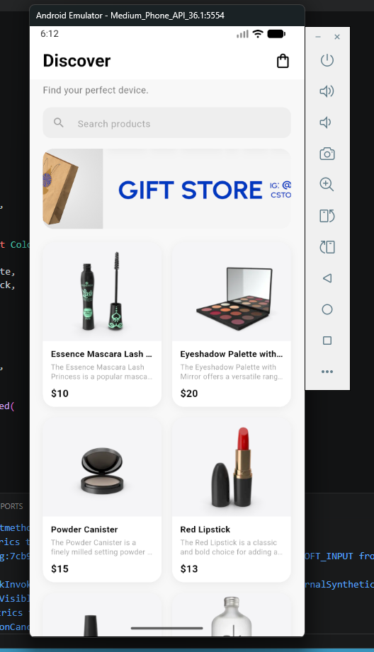
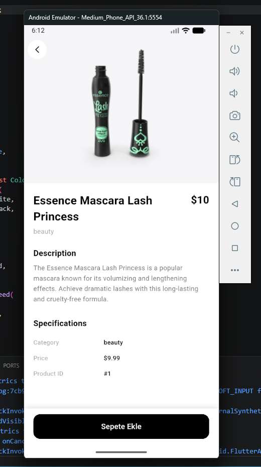
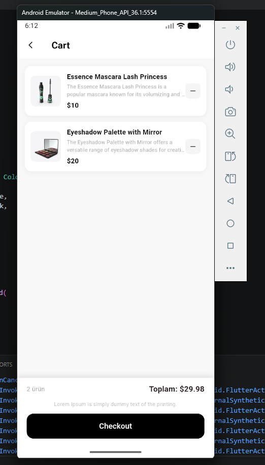
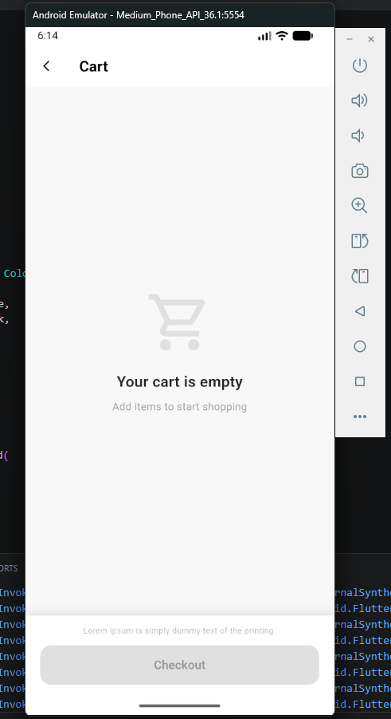

<div align="center">

<h1>📱 Mini Katalog Uygulaması</h1>

<p>Flutter ile geliştirilmiş, ürün listeleme, detay görüntüleme ve sepet yönetimi sunan mini e-ticaret katalog uygulaması.</p>


</div>

---

## 📸 Ekran Görüntüleri

<div align="center">

| Ana Sayfa | Ürün Detayı | Sepet | Boş Sepet |
|:---------:|:-----------:|:-----:|:---------:|
|  |  |  |  |
| Discover ekranı, arama ve ürün grid'i | Ürün açıklaması ve sepete ekle | Sepetteki ürünler ve checkout | Boş sepet durumu |

</div>

---

## 📋 Proje Hakkında

Bu uygulama **Flutter Günlük Eğitim Programı** kapsamında geliştirilmiştir.  
Temel Flutter mimarisini, widget yapısını, sayfa geçişlerini ve veri yönetimini kapsayan **beş günlük eğitim** sonucunda ortaya çıkan proje çıktısıdır.

### 🎯 Temel Özellikler

- 🔍 **Ürün Arama & Filtreleme** — anlık arama ile ürün listesi filtrelenir
- 🛍️ **Ürün Detay Sayfası** — görsel, açıklama ve özellikler
- 🛒 **Sepet Yönetimi** — ekleme / çıkarma, toplam tutar ve checkout akışı
- 🌐 **API Entegrasyonu** — `dart:io` HttpClient ile harici veri çekme (ekstra paket kullanılmamıştır)
- 📦 **Akıllı Yedekleme** — birincil API → yedek API → yerleşik mock veri
- 🔄 **Gerçek Zamanlı Durum** — `ValueNotifier` ile sepet badge anında güncellenir

---

## 🗂 Proje Yapısı

```
lib/
├── main.dart                          # Uygulama giriş noktası & tema
├── models/
│   └── product.dart                   # Ürün veri modeli (fromJson / toJson)
├── services/
│   ├── api_service.dart               # HTTP veri çekme servisi
│   └── cart_service.dart              # ValueNotifier tabanlı sepet yöneticisi
├── screens/
│   ├── home_screen.dart               # Ana sayfa (Discover)
│   ├── product_detail_screen.dart     # Ürün detay sayfası
│   └── cart_screen.dart               # Sepet sayfası
└── widgets/
    └── product_card.dart              # Yeniden kullanılabilir ürün kartı widget'ı
```

---

## 🛠 Kullanılan Araçlar ve Teknolojiler

| Araç | Sürüm | Amaç |
|------|-------|-------|
| Flutter SDK | 3.x | Mobil uygulama geliştirme |
| Dart SDK | ≥ 3.0.0 | Programlama dili |
| Visual Studio Code | Güncel | Kod editörü |
| Android Studio | Güncel | Emülatör yönetimi |
| `dart:io` | Yerleşik | HTTP istekleri (ekstra paket yok) |
| `dart:convert` | Yerleşik | JSON parse işlemleri |
| `material.dart` | Yerleşik | UI bileşenleri |

> ⚠️ **Not:** Proje kapsamı gereği hiçbir ekstra `pub.dev` paketi kullanılmamıştır.

---

## 🌐 Veri Kaynakları

| Öncelik | Kaynak | URL |
|---------|--------|-----|
| 1. Birincil API | WantAPI Ürünler | `https://wantapi.com/products.php` |
| 2. Yedek API | DummyJSON | `https://dummyjson.com/products` |
| 3. Offline | Yerleşik Mock Veri | Uygulama içinde tanımlı |

Banner görseli: `https://wantapi.com/assets/banner.png`

> Bu adresler gerçek bir e-ticaret altyapısını temsil etmez; API kullanımı, veri modelleme ve listeleme mantığını öğretmek amacıyla kullanılmıştır.

---

## 🚀 Kurulum ve Çalıştırma

### Ön Gereksinimler

- [Flutter SDK](https://docs.flutter.dev/get-started/install) kurulu olmalıdır
- Android Emülatör veya fiziksel Android/iOS cihaz hazır olmalıdır

### Adımlar

**1. Repoyu klonlayın**

```bash
git clone https://github.com/<kullanici-adi>/mini_katalog.git
cd mini_katalog
```

**2. Bağımlılıkları yükleyin**

```bash
flutter pub get
```

**3. Flutter ortamını doğrulayın** *(isteğe bağlı)*

```bash
flutter doctor
```

**4. Uygulamayı çalıştırın**

```bash
flutter run
```

**5. Belirli bir cihaz için çalıştırma**

```bash
# Bağlı cihazları listele
flutter devices

# Seçili cihazda çalıştır
flutter run -d <device-id>
```

---

## 📐 Mimari & Tasarım Kararları

### Sayfa Geçişleri

```dart
// Ürün detayına geçiş (Route Arguments ile)
Navigator.push(
  context,
  MaterialPageRoute(
    builder: (_) => ProductDetailScreen(product: product),
  ),
);
```

### Sepet State Yönetimi

`CartService` singleton + `ValueNotifier` kullanılarak ekstra paket ihtiyacı olmadan reaktif state yönetimi sağlanmıştır:

```dart
// Sepetteki değişikliği dinleme
ValueListenableBuilder<List<Product>>(
  valueListenable: CartService().cartNotifier,
  builder: (context, cart, _) { ... },
)
```

### JSON Veri Modeli

```dart
// fromJson
factory Product.fromJson(Map<String, dynamic> json) { ... }

// toJson
Map<String, dynamic> toJson() => { ... }
```

---

## ✅ Proje Çıktıları (Eğitim Kazanımları)

- [x] Çalışan bir **Mini Katalog Uygulaması**
- [x] Ana sayfa → Ürün listesi → Ürün detayı ekran yapısı
- [x] Sayfa geçişleri — `Navigator.push / pop`
- [x] **Route Arguments** ile sayfalar arası veri aktarımı
- [x] **GridView.builder** ile kart tabanlı ürün listeleme
- [x] **Basit state güncelleme** — `ValueNotifier` ile sepet yönetimi
- [x] Proje klasör yapısını doğru kullanma
- [x] Görsel ve veri yönetimi (Image.network, API)

---

## 📄 Lisans

Bu proje eğitim amaçlı geliştirilmiştir.

---

<div align="center">
  <sub>Flutter Günlük Eğitim Programı · Mini Katalog Uygulaması</sub>
</div>
